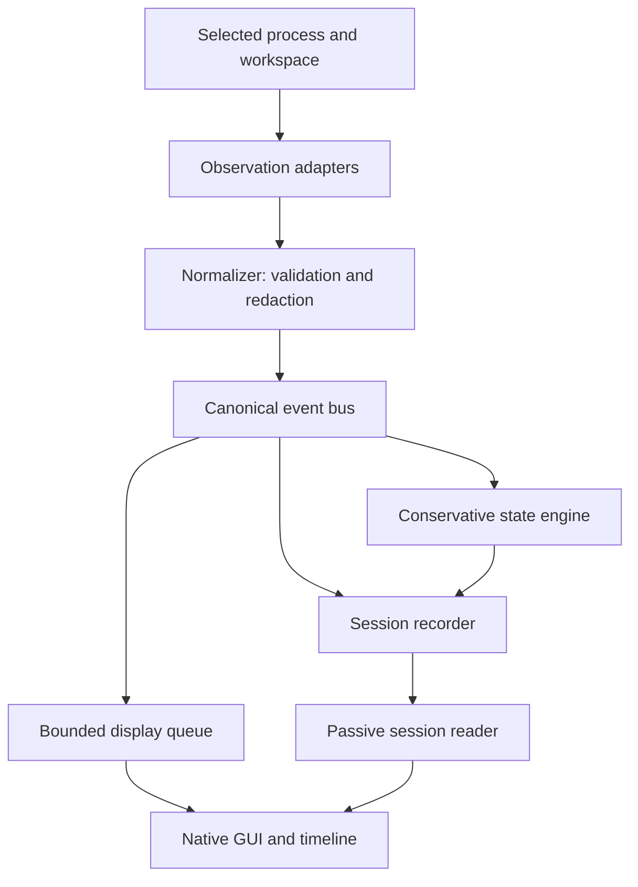

# Agent Process Microscope

**See what AI agents are doing, how we know, and what happened next.**

Agent Process Microscope (APM) is an experimental Windows-first observability
system for evidence-backed, human-readable inspection and replay of AI-agent activity.

**Status: Experimental Genesis Implementation — 0.1.0**

Genesis is a working native desktop prototype with a recorded **66-test passing
baseline**. Broader agent correlation, application instrumentation and cross-environment
observation remain future work. [Validation and its limits](docs/VALIDATION.md).

## Why APM exists

“The agent is working” leaves a human with little to inspect. APM presents external
evidence: a process was observed, workspace metadata changed, a recognizable test
runner appeared, or a command result was reported. A timeline connects that evidence
to conservative activity summaries and lets the human inspect what supports them.

The metaphor combines a **microscope**, which reveals detail, with a **television**,
which presents activity over time. [Vision](docs/VISION.md) · [Project principles](docs/PRINCIPLES.md).

## What APM is — and is not

APM is a local observer with adapters, normalized events, durable recordings and a
native Python/Tk GUI. Codex is the first agent-specific integration, not the core
architecture. Live **Attach** mode observes a chosen PID and workspace; a separate
passive importer accepts deliberately selected `codex exec --json` exports.

APM does **not** inspect hidden chain-of-thought, private model reasoning or inaccessible
model internals. It is not a screen recorder, keylogger, credential collector, covert
monitor, agent permission system or security sandbox. It does not read private
Codex rollout histories or make model API calls.

## Current Genesis capabilities

| Capability | What is available now | Evidence boundary |
|---|---|---|
| Process observation | Selected process and verified descendants, PID/creation-time identity | Polling can miss short-lived processes; attach exit codes are unknown. |
| File activity | Bounded workspace metadata snapshots and CREATE/WRITE/DELETE events | No file contents or READ detection; changes do not identify their author. |
| Git awareness | Scoped status and staged/unstaged line-count summaries | No patch capture or automatic repository changes; snapshots are not atomic. |
| Test awareness | Conservative recognition of a small set of direct runners | Recognition is inference; real assertion counts are not collected. |
| Telemetry | CPU, RAM, disk and network rates | Machine aggregates, not agent-specific network attribution. |
| GUI | Timeline, search, filters, activity, telemetry and selectable event details | The visible history holds the latest 2,000 events. |
| Recording/replay | JSONL sessions, basic recovery and passive chronological replay | Replay presents events; it never executes their commands. |
| Codex adapter | Allowlisted, finite JSONL import of official CLI action reports | Imported reports are not independent OS proof. |
| Demo/security | Explicitly synthetic demonstration and pre-persistence redaction | Pattern-based redaction is best effort. |

**Stop observation does not terminate the attached process.** Pause Display leaves
collection running. Clear View changes the display without deleting recordings.

## Architecture



The separate Codex import path normalizes allowlisted records and writes sessions
directly; it does not start a live observer. See [architecture](docs/ARCHITECTURE.md),
[event model](docs/EVENT_MODEL.md), and [adapter contracts](docs/ADAPTER_MODEL.md).

## Evidence versus inference

| Status | Meaning |
|---|---|
| **OBSERVED** | A scoped source reported external evidence. Source provenance still matters. |
| **INFERRED** | A conservative interpretation derived from evidence. |
| **SYNTHETIC** | Demonstration or fixture data, never claimed as live activity. |
| **UNKNOWN** | The evidence does not establish a requested fact. |
| **UNAVAILABLE** | A source could not supply the observation. |

For example, a changed file does not prove that Codex edited it. A recognized runner
suggests testing; it does not establish how many assertions passed. Each derived
state retains evidence references. Confidence is a local annotation, not a calibrated
probability. [Observability model](docs/OBSERVABILITY_MODEL.md).

## Four magnification levels

The conceptual lenses are **Human → Action → Engineering → Evidence**. The current
GUI calls them **Overview → Activity → Evidence → Raw event**:

1. **Overview:** action, target, uncertainty and explanation.
2. **Activity:** category, source, agent, timestamp and interpretation level.
3. **Evidence:** retained metadata and references, including process details when available.
4. **Raw event:** the complete **sanitized canonical event**, not an unrestricted raw stream.

All four views describe the same event. Missing fields remain missing; attach mode
does not invent an exit code. [Event model](docs/EVENT_MODEL.md).

## Semantic Television

Screen recording stores pixels. APM attempts to present sequences with evidence:

```text
PROCESS OBSERVED → WORKSPACE CHANGE → TEST RUNNER RECOGNIZED → STATE UPDATE
```

A future instrumented sequence might support `EDIT → TEST → FAIL → CORRECT → PASS`.
Genesis does not claim that level of intent or attribution from metadata alone.
[Semantic Television](docs/SEMANTIC_TELEVISION.md).

## Installation and development

Use Windows with Python and Tk available. The recorded baseline used **Python 3.14.7,
Tk 9.0 and psutil 7.2.2**. Package metadata requires Python 3.12 or later, but that is
not a claim that every declared version has been validated. Git is optional for
observation and required for Git-specific validation.

From the repository directory:

```powershell
python -m venv .venv
.\.venv\Scripts\python.exe -m pip install -r requirements.txt
.\.venv\Scripts\python.exe -m pip install -e . --no-deps
.\.venv\Scripts\python.exe -m apm --demo
```

For the idle GUI without a console helper:

```powershell
.\.venv\Scripts\pythonw.exe .\Launch-APM.pyw
```

Choose **Attach process**, select a workspace and enter its existing root PID, then
press **Start observation**. No observation begins merely by opening the idle GUI.
There is no standalone Windows EXE or installer in this repository.

### CLI

These PIDs and paths are placeholders; use a process and workspace you intend to observe.

```powershell
.\.venv\Scripts\apm.exe start --pid 12345 --workspace C:\Example\Project
.\.venv\Scripts\apm.exe start --pid 12345 --workspace C:\Example\Project --headless --duration 60
.\.venv\Scripts\apm.exe replay .\sessions\YOUR_SESSION
.\.venv\Scripts\apm.exe inspect .\sessions\YOUR_SESSION
.\.venv\Scripts\apm.exe import-codex C:\Example\Exports\exec.jsonl
```

Codex import excludes reasoning, messages, command output and arbitrary tool payloads.
It does not sanitize or overwrite the original export. [Codex boundary](docs/CODEX.md).

## Session recording and passive replay

A session contains `session.json`, `events.jsonl` and `derived_states.jsonl`.
Recordings stay local and are excluded from Git. Metadata is atomically replaced;
JSONL is periodically flushed. Replay validates the schema, bounds input size and
can recover valid records before a truncated final line. It does not silently skip
corruption in the middle. [Replay and durability](docs/REPLAY_MODEL.md).

In the GUI, **Open session** loads a recording and **Play replay** presents its events.
Replay reconstructs conservative states from the event history without starting adapters.
The default session location is beside the installed `apm` package; in a source
checkout it is the repository's `sessions/` directory. Live sessions can choose
another directory with `--sessions` or the GUI field.

## Security and limitations

Redaction occurs before normal live events reach queues and storage, and imported
sessions are sanitized again. Local recordings are plaintext and potentially
sensitive even after redaction. **Do not upload personal sessions, logs, screenshots,
credentials or private command lines to issues.** Use fictional reproductions.
[Security model and reporting](SECURITY.md).

Genesis does not provide browser/Joomla instrumentation, managed agent launch,
GPU telemetry, a standalone signed EXE, WSL certification, production privacy
certification or universal attribution. Private reasoning inspection is outside
the project's purpose. [Current limitations](LIMITATIONS.md).

## Testing

```powershell
.\.venv\Scripts\python.exe -m unittest discover -s tests -v
# Optional local report; creates ignored reports/ files:
.\.venv\Scripts\python.exe scripts\run_checks.py
```

The recorded Genesis baseline is **66 passed, 0 failures, 0 errors, 0 skips**.
It includes scoped attach, non-terminating Stop, passive replay, Git safety,
storage/redaction and GUI tests. The native window smoke and small resource sample
are documented separately. These results are local evidence, not a certification
or a claim that GitHub CI has run. [Validation](docs/VALIDATION.md).

## Roadmap and contributions

[ROADMAP.md](ROADMAP.md) separates the implemented foundation from stronger agent
correlation, future browser/Joomla demonstrations and cross-environment research.
See [CONTRIBUTING.md](CONTRIBUTING.md) for focused changes and safe bug reports.

## License

Licensed under the [Apache License 2.0](LICENSE), using the official, unmodified
[Apache license text](https://www.apache.org/licenses/LICENSE-2.0.txt).
Copyright 2026 chatgptopenaiagi. See [NOTICE](NOTICE).
