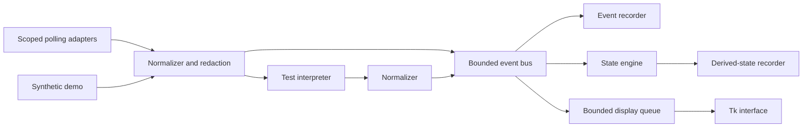

# Architecture

Agent Process Microscope (APM) Genesis is a local Python application with a native Tkinter/ttk interface. It collects scoped external evidence, normalizes and redacts that evidence, records it, and presents labelled interpretations. It does not inspect private model reasoning.

The implementation is deliberately small: one collection worker, bounded queues, a local recorder, a deterministic state engine, and a Tk event loop. There is no web server, remote telemetry service, or model call in this architecture.

## Live observation

[`Controller`](../apm/core/controller.py) owns one session. In attach mode it creates process, filesystem, Git, and system observers after observation starts. In demo mode it emits synthetic fixtures instead. The live test interpreter can add an inferred test event when a recognized command supports that interpretation; the original event remains separate.

The event bus invokes the recorder, state consumer, and display consumer in that order. Recorder or consumer failures propagate to the controller and can end the session with an error. This is not a transactional message broker with retries or exactly-once delivery.

Default polling intervals are one second for processes, two seconds for filesystem and system counters, and ten seconds for Git. These are scheduling intervals, not real-time guarantees: adapters run sequentially on the collection worker, and a bounded poll can delay another poll.

## Import and replay are separate paths

The CLI's explicit Codex JSONL import does **not** pass through the live controller, event bus, or test interpreter. It uses `CodexAdapter → Normalizer → Recorder + StateEngine`. Imported command reports can affect the state engine, but this path does not add the live interpreter's separate inferred test events. See [Adapter model](ADAPTER_MODEL.md).

Replay uses `read_session → fresh StateEngine + UI`. It reads canonical events, sorts them chronologically, and reconstructs presentation state without creating live observers or executing event targets. The saved derived-state file is not replay's source of truth. See [Replay model](REPLAY_MODEL.md).

## Components and responsibilities

| Component | Responsibility | Boundary |
| --- | --- | --- |
| `apm/observers` | Collect scoped metadata or explicitly selected protocol reports | No private reasoning capture; unavailable evidence is labelled |
| `apm/core/events.py` | Canonical event validation, session identity, redaction | Adapter payloads must be normalized before normal use |
| `apm/core/bus.py` | Bounded live event delivery | Queue overflow can lose events before recording |
| `apm/core/state.py` | Conservative evidence-linked activity summaries | Inference is not proof of intent or causation |
| `apm/storage` | Local recording and bounded passive reading | Plaintext files; no authenticity or encryption guarantee |
| `apm/ui` | Timeline, filters, activity, telemetry, evidence lenses | Display controls do not control the observed process |
| `apm/__main__.py` | GUI, headless observation, inspection, import and replay entry points | Managed launch of an observed agent is not implemented |

Core, storage, and adapters do not depend on the UI. Tk widgets are updated on the Tk thread; lifecycle and session-reading work run off that thread.

## Lifecycle and durability

Opening the normal GUI does not start observation. The user selects a workspace and PID and chooses **Start observation**. `--demo` is an explicit exception that starts the synthetic demonstration. A GUI `start` command with a PID pre-fills the controls; it still requires the start action.

Controller status progresses through `ready`, `starting`, `recording`, `stopping`, and `stopped`, with `error` available for failures. `stop()` requests shutdown without blocking; `wait()` checks worker completion. The GUI waits for completion before closing or switching to replay. Stopping APM does not terminate the attached process.

Each session contains `session.json`, `events.jsonl`, and `derived_states.jsonl`. Metadata is replaced atomically. The recorder checks for a flush/fsync once a second when recording or the worker makes progress, and forces a flush during orderly close. Metadata checkpoints are scheduled every five seconds. These are progress-driven checks, not independent timing guarantees; blocking polls, I/O failures, or abrupt termination can leave an incomplete tail or stale checkpoint.

## Bounds and overload

| Layer | Genesis default |
| --- | --- |
| Live event bus | 2,048 queued events; new events are dropped when full |
| Display queue | 2,048 events; oldest display event is discarded when full |
| Visible timeline | Latest 2,000 retained events |
| GUI consumption | At most 200 events per normal update batch |
| Recorded event stream | At most 100,000 events or 64 MiB in `events.jsonl` |
| Replay input | Bounded files, lines, and event count; see [Replay model](REPLAY_MODEL.md) |

The event-stream byte cap is **not** a 64 MiB cap on the whole session directory: metadata and derived states are separate files. Replay can hold more than 2,000 source events in memory; 2,000 is the visible timeline limit. A paused display also retains its frozen visible rows while the live view buffer continues to advance.

The UI's **Dropped** count combines event-bus and display-queue drops. Session metadata records the two counts separately. A bus drop means evidence did not reach the recorder; a display drop can occur after recording. Neither should be confused with normal eviction from the 2,000-row view.

## Execution boundary

The GUI, replay, and demo do not require PowerShell helpers. Git observation uses bounded, hidden Git subprocesses on Windows with `shell=False`; those are APM-owned helpers, not the attached workload. The local Python windowed launcher is a convenience entry point, not a standalone executable or signed installer. See [Security](../SECURITY.md) for scope and disclosure limits.
